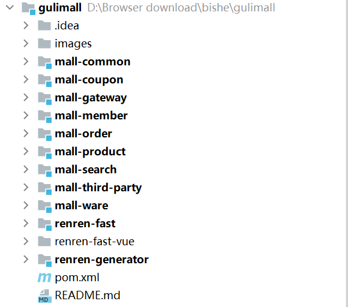

商城系统的开发

  由于Centos7大部分停止维护下架问题，本次我才用WSL2+Ubuntu20.04.6LTS，同理在Ubuntu下安装Docker管理mysql5.7和redis。

<h2>环境信息:</h2>

<h4>本地可视化连接mysql和redis时输入的主机IP地址信息  192.168.2.44</h4>

| 软件名 | 版本号 | 描述信息           |
| ------ | ------ | ------------------ |
| nacos  | 1.1.3  | 微服务的注册和发现 |
| mysql  | 5.7    | 数据库             |
| redis  | ^      | 缓存               |
|        |        |                    |

<h2>模块介绍：</h2>

| 模块名           | 中文含义       | 信息描述                                 |
| ---------------- | -------------- | ---------------------------------------- |
| mall-common      | 公共模块       | 保存常量，异常码，工具类，部分实体类     |
| mall-coupon      | 优惠卷模块     | 优惠卷服务                               |
| mall-gateway     | 网关模块       | 接收前端请求做通义转发，微服务的重要部分 |
| mall-member      | 会员模块       | 会员服务                                 |
| mall-order       | 订单模块       | 订单服务                                 |
| mall-product     | 商品模块       | 商品服务                                 |
| mall-third-party | 放置第三方服务 | OSS服务                                  |
| mall-ware        | 库存模块       | 仓库服务                                 |
| renren-fast      | 人人后端       | 人人开源后端开发                         |
| renren-fast-vue  | 人人后端页面   | 人人开源前端开发                         |
| renren-generator | 人人代码生成   | 人人开源代码生成器                       |